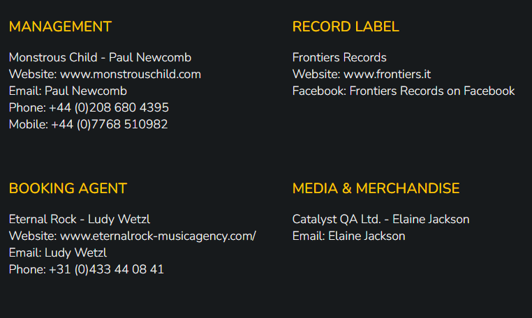

# Praying Mantis

Praying Mantis is the official band website for the British rock band Praying Mantis. The site is targeted toward fans of the band as well as concert promoters. The website will give the user an overview of the history and discography of the band, upcoming tour dates and contact information. The band has an outdated website that could use a new layout.

You can find the live site [here](https://stefaniegadow.github.io/praying-mantis/index.html).

## User Experience (UX)

### User Stories

- As a user, I want to be able to get an overview of upcoming tour dates.
- As a user, I want to be able to read about the band’s history.
- As a user, I want to be able to find information about their released albums.
- As a user, I want to be able to contact the band.
  
## Design

### Colour scheme

The red and yellow colours were taken from the band logo.

### Typography

“Nunito” is the font used for the website, with sans serif as a fallback. This font is simple and provides good readability.

### Imagery

Visual representation is an essential part of a band website. The visuals provide the user with information about the kind of music that the band is known for.

### Overall Feel

The main objective in creating this website is to visually represent the band’s music style while providing the user with all the necessary information.

### Wireframes

All wireframes were designed for laptop/desktop, iPad/tablet and phone screens.

[Home - desktop](assets/wireframes/home-desktop.png) [Home - tablet](assets/wireframes/home-tablet.png) [Home - phone](assets/wireframes/home-phone.png)

[Band - desktop](assets/wireframes/band-desktop.png) [Band - tablet](assets/wireframes/band-tablet.png) [Band - phone](assets/wireframes/band-phone.png)

[Discography - desktop](assets/wireframes/discography-desktop.png) [Discography - tablet](assets/wireframes/discography-tablet.png) [Discography - phone](assets/wireframes/discography-phone.png)

[Contact - desktop](assets/wireframes/contact-desktop.png) [Contact - tablet](assets/wireframes/contact-tablet.png) [Contact - phone](assets/wireframes/contact-phone.png)

## Features

### Current features

- Navigation bar
  - The navigation bar is featured on all four pages of the project. It includes links to the logo, the home, band, discography and contact pages. The navigation bar is fully responsive and changes into a hamburger menu on smaller screens.
  - The navigation bar will allow users to navigate the website easily and is identical on all pages for better usability.

- Hero image slider
  - The hero image slider contains three different images. The images help the user to get a better feeling of the band’s music. 
  - A first-time visitor of the website will get a positive, visual introduction to the band.

- Tour dates section
  - The tour dates section provides an overview of upcoming tour dates and links to purchase tickets.

- The footer
  - The footer includes links to the social media pages of the band. The social media pages will open in new tabs to allow users to navigate easily.

- Band page
  - The band page introduces the user to the individual members of the band.

  - The user can read an interesting article about the band’s long history.

- Discography page
  - The discography page shows all albums that the band has released until today. 

- Contact page
  - The contact page provides information about the band’s management, record company and booking agent. 

  - The contact form allows users a convenient way to send a message to the band.

### Future Features

- Every album on the discography page could get its own page with song titles, lengths, and information about the record producer. 
- Each individual band member could get the chance to introduce themselves to the fans.
- A media section with more images and videos could be implemented.

## Technologies Used

### Languages Used

- HTML
- CSS

### Frameworks, Libraries and Programs Used

- [Font Aweesome](https://fontawesome.com/) used for icons.
- [Google Fonts](https://fonts.google.com/) used to import “Nunito” font.
- [GitHub](https://github.com) used to host repository.
- [Codeanywhere](https://app.codeanywhere.com/) used to develop the project and organise version control.
- [GitHub Pages](https://pages.github.com/) used to deploy the site.
- [Adobe XD](https://helpx.adobe.com/de/support/xd.html) used to create wireframes.
- [Lighthouse](https://developer.chrome.com/docs/lighthouse/overview/) for performance review.
- [PowerMapper](https://www.powermapper.com/) used to check compatibility with older browsers.
- [Responsinator](http://www.responsinator.com/) used to check site was responsive on different screen sizes.

## Testing

### Validating

After the completion of sections, the following websites were used to check for syntax errors:
- HTML – [HTML validator](https://validator.w3.org/nu/)
- CSS – [CSS validator](https://jigsaw.w3.org/css-validator/)
No errors or warnings found.

### Testing User Stories from UX Section

- As a user, I want to be able to get an overview of upcoming tour dates.
  - The homepage shows the upcoming tour dates. The page looks good on all screen sizes.
- As a user, I want to be able to read about the band’s history.
  - The band page is fully responsive and works on all screen sizes. 
- As a user, I want to be able to find information about their released albums.
  - The discography page provides information about the band’s albums and adjusts to different breakpoints.
- As a user, I want to be able to contact the band.
  - The contact information of the management and booking agent is available, and links open in new tabs. The contact form adjusts to different screen sizes.

### Further Testing

#### Personal Testing

Through devices that are readily available to me, I was able to test the page on:

- iPhone SE – Safari
- iPad mini – Safari
- MacBook – Safari
- Windows laptop – Google Chrome
- Windows laptop – Microsoft Edge
- Windows laptop – Mozilla Firefox

#### Responsinator

Responsinator was used to ensure that the website was responsive on all devices and browsers.

#### Third-party Testing

I asked a few people to test the website on various devices. Their feedback was incorporated into the latest version.

#### Lighthouse

Lighthouse was used to see if there were issues with the performance of the website. 

#### PowerMapper

PowerMapper was used to check the website for compatibility across different browsers.

## Deployment

This site was deployed through GitHub Pages using the following steps:

1. Log into GitHub.
2. Locate the repository.
3. Locate the settings option along the options bar.
4. Locate GitHub Pages options towards the bottom of the page.
5. In 'Source' dropdown, select 'Master' from the branch options.
6. Click the save button.
7. 
The site is now published though it may not be accessible straight away.

The site URL will be visible on the green bar under the section header. This will remain there permanently, and you can refer back to it at any time.

The live link can be found [here](https://stefaniegadow.github.io/praying-mantis/index.html) 

## Credits

### Code

- The hero image slider was created with the help of this [tutorial](https://www.w3docs.com/snippets/css/how-to-create-an-image-slider-or-slideshow.html#slide-1). Commented in HTML and CSS for clarity.
- The change from the desktop navigation bar to the hamburger menu on smaller screens was created using this [tutorial](https://www.youtube.com/watch?v=QQlxvj_GKss). Commented in HTML and CSS for clarity.
- 
### Content

The majority of the content was taken from the existing [Praying Mantis website](https://www.prayingmantis.rocks). Some smaller parts were added since their band history was not updated since 2019. 

### Media

All album covers, and the band logo were taken from the existing [Praying Mantis website](https://www.prayingmantis.rocks).
All band photographs are my own. 

